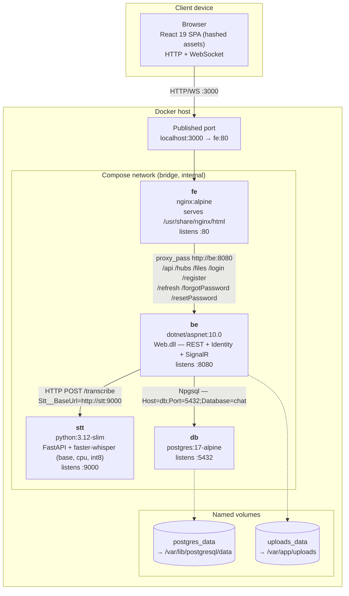
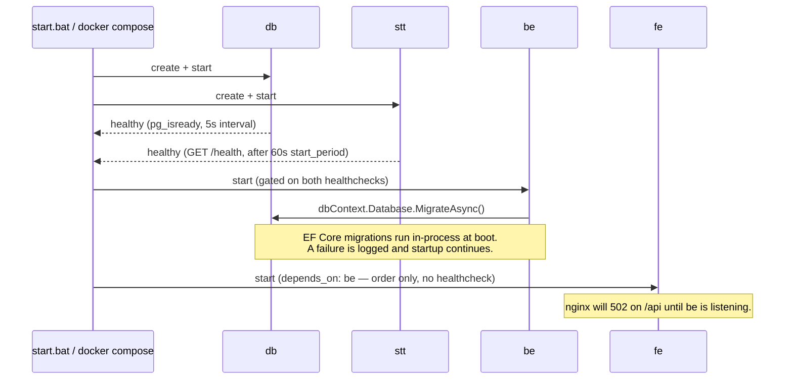

# Deployment Diagram

How Andrey Chat is deployed: four containers on one Docker Compose network, with a
single published host port. Everything here is derived from
[docker-compose.yml](../docker-compose.yml), the three Dockerfiles, and
[FE/nginx.conf](../FE/nginx.conf) — if those change, this document is stale.

## Topology



## Nodes

| Service | Image / build | Listens | Published to host | Depends on |
|---|---|---|---|---|
| `fe` | multi-stage: `node:24-alpine` build → `nginx:alpine` | `:80` | **`3000:80`** — the only published port | `be` (start order only) |
| `be` | multi-stage: `dotnet/sdk:10.0` → `dotnet/aspnet:10.0`, runs as `$APP_UID` | `:8080` | none | `db` (healthy), `stt` (healthy) |
| `stt` | `python:3.12-slim` + uvicorn | `:9000` | none | — |
| `db` | `postgres:17-alpine` | `:5432` | none (see [Test overlay](#test-overlay)) | — |

Only `fe` is reachable from outside the Compose network. `be`, `stt`, and `db` are
addressed by service name over the internal bridge network and have no host binding —
this is what the `platform-constraints` spec requires of the deployed topology.

## Artifacts on each node

| Node | What ships in the image |
|---|---|
| `fe` | The Vite `dist/` output (`index.html` + hashed `/assets/*`) copied to `/usr/share/nginx/html`, plus [nginx.conf](../FE/nginx.conf) as `/etc/nginx/conf.d/default.conf` |
| `be` | `dotnet publish` output of `BE/Web` (Domain / Application / Infrastructure as assemblies), entrypoint `dotnet Web.dll`; `/var/app/uploads` pre-created and chowned to `$APP_UID` at build time |
| `stt` | `app.py` (FastAPI: `GET /health`, `POST /transcribe`) plus `faster-whisper`; the Whisper model is loaded at process start, hence the 60s healthcheck `start_period` |
| `db` | Stock PostgreSQL 17; schema is created at runtime, not baked in — see [Startup order](#startup-order) |

## Communication paths

| From → To | Protocol | Address | Notes |
|---|---|---|---|
| Browser → `fe` | HTTP/1.1 + WebSocket | `http://localhost:3000` | `/assets/` served `immutable, max-age=31536000`; `index.html` served `no-store`; unknown paths fall back to `index.html` (SPA routing) |
| `fe` → `be` | HTTP/1.1 reverse proxy | `http://be:8080` | Matches `^/(api\|hubs\|files\|register\|login\|refresh\|forgotPassword\|resetPassword)`. `Upgrade`/`Connection` headers are forwarded, which is what lets `/hubs/chat` run as a WebSocket. `client_max_body_size 25m` caps attachment uploads at the edge. |
| `be` → `db` | PostgreSQL wire (Npgsql) | `Host=db;Port=5432;Database=chat` | Credentials `postgres/postgres` come from the `db` service environment |
| `be` → `stt` | HTTP `POST /transcribe` (multipart) | `http://stt:9000` | Configured via `Stt__BaseUrl`; used by `FasterWhisperTranscriptionService` behind `api/transcribe` and a background service |

Both browser channels — REST/Identity and the SignalR hub at `/hubs/chat` — travel over
the same origin through the same nginx, so the client sees one endpoint.

## Persistent state

| Volume | Mounted into | Holds | Lost on |
|---|---|---|---|
| `postgres_data` | `db:/var/lib/postgresql/data` | All application data, including Identity users and message history | `docker compose down -v` |
| `uploads_data` | `be:/var/app/uploads` | Attachment blobs written by `LocalFileStorage` (`Storage:Root` in [appsettings.json](../BE/Web/appsettings.json)) | `docker compose down -v` |

Attachment bytes live on the filesystem, not in the database, so the two volumes must be
backed up and restored **together** — a `postgres_data` restore against an empty
`uploads_data` leaves rows pointing at files that no longer exist.

Neither volume is shared between containers, so `be` is the only writer of uploads. That
also means `be` cannot be scaled past one replica in this topology without first
replacing `LocalFileStorage` with shared or object storage.

## Configuration surface

Set on `be` in [docker-compose.yml](../docker-compose.yml):

| Variable | Value | Effect |
|---|---|---|
| `ConnectionStrings__DefaultConnection` | `Host=db;Port=5432;Database=chat;Username=postgres;Password=postgres` | Database target |
| `ASPNETCORE_ENVIRONMENT` | `Production` | **Swagger UI is off in Docker** — it is mapped only under Development ([Program.cs](../BE/Web/Program.cs)). To browse it, run `dotnet run --project BE/Web` locally. |
| `ASPNETCORE_URLS` | `http://+:8080` | Bind address inside the container |
| `Cors__AllowedOrigins__0` | `http://localhost` | Default CORS policy origin |
| `Stt__BaseUrl` | `http://stt:9000` | Transcription service address |

On `stt`, baked into the image: `STT_MODEL_SIZE=base`, `STT_DEVICE=cpu`,
`STT_COMPUTE_TYPE=int8`. On `db`: `POSTGRES_DB=chat`, `POSTGRES_USER=postgres`,
`POSTGRES_PASSWORD=postgres`.

Every credential above is a development default checked into the repository. A real
deployment must override the database password, the CORS origin, and the published port
— and terminate TLS in front of `fe`, which this topology does not do.

## Startup order



`db` and `stt` come up in parallel; `be` waits for both to report healthy. The `fe`
dependency on `be` carries no `condition`, so nginx can accept requests before the
backend is ready — the first proxied calls after a cold start may 502. `start.bat`
papers over this with a fixed 15-second wait before opening the browser.

Schema management is a deployment concern here, not a build step: `be` applies pending
EF Core migrations against `chat` on every start. Because a migration failure is caught
and logged rather than fatal, a broken migration leaves a running backend on an outdated
schema — check the `be` logs after deploying one.

## Test overlay

[docker-compose.tests.yml](../docker-compose.tests.yml) adds exactly one thing: `db`
publishes `55432:5432` on the host, so the backend integration suite — which runs in the
test process, not in a container — can create and drop its own `chat_test_*` databases.

```
docker compose -f docker-compose.yml -f docker-compose.tests.yml up -d db
```

It is deliberately a separate file so the base topology stays port-free, and `55432`
rather than `5432` avoids colliding with a locally installed PostgreSQL. See
[Automated tests](../CLAUDE.md#automated-tests) for what each test layer needs running.

## Known deployment-level gaps

- **No TLS.** Traffic is plain HTTP end to end; nginx listens on `:80` only.
- **Direct navigation to `/login` and `/register` returns 405.** nginx routes those paths
  to the backend's Identity endpoints, so the SPA's own screens are reachable only by
  client-side routing from `/`; a page refresh on either one breaks.
- **Single-replica backend**, for the `uploads_data` reason above.
- **No log aggregation.** Serilog writes to console only, so logs live in container
  stdout and are lost with the container.
